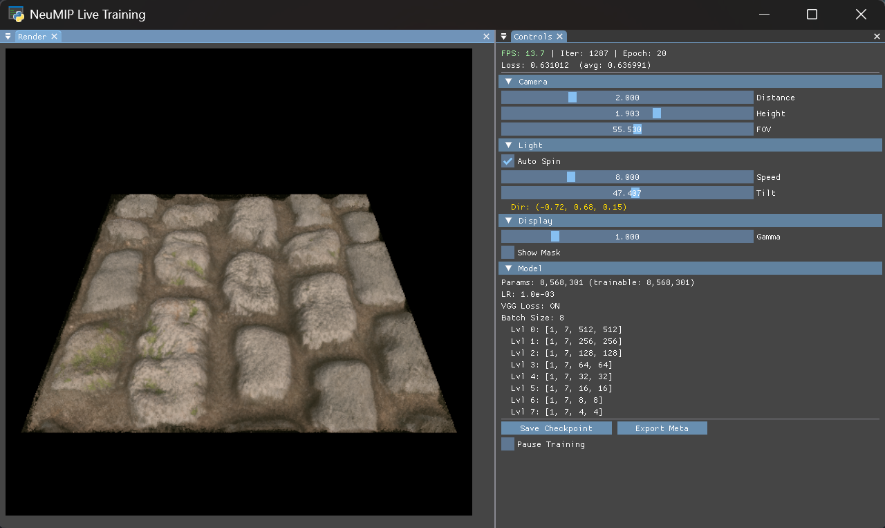

<div align="center">

# VULTORCH

**GPU-Native Tensor Visualization for PyTorch**

Visualize CUDA tensors at GPU speed — zero CPU readback, zero staging buffers.
Neural rendering, reinforcement learning, physics — if it's in a tensor, Vultorch can display it.

[](LICENSE)
[](https://python.org)
[](https://vulkan.org)

**[🇨🇳 中文](README_CN.md) · [🌐 Website](https://ChenlizheMe.github.io/Vultorch/) · [📖 Tutorial](https://ChenlizheMe.github.io/Vultorch/tutorial/)**

<br>



</div>

---

## Overview

Vultorch displays CUDA tensors in a native window — data never leaves the GPU.
`show()` performs a fast GPU-GPU copy; `create_tensor()` eliminates even that via Vulkan shared memory.

```python
vultorch.show(tensor)                     # GPU-only, no CPU readback
tensor = vultorch.create_tensor(...)      # true zero-copy, no memcpy at all
```

## Key Features

- **GPU-only display** — `vultorch.show(tensor)` does a fast GPU-GPU copy to Vulkan, no CPU readback ever
- **True zero-copy** — `vultorch.create_tensor()` returns a torch.Tensor backed by Vulkan shared memory — zero memcpy
- **Declarative API** — `View → Panel → Canvas` with auto layout and per-frame callback support
- **Built-in ImGui** — Sliders, buttons, color pickers, plots, docking layout — all from Python
- **3D scene view** — Map textures onto lit 3D planes with orbit camera, MSAA, Blinn-Phong shading
- **Docking windows** — Drag-and-drop window arrangement (ImGui docking branch)
- **Not just rendering** — RL environments, cellular automata, signal processing — anything tensor-based

## Quick Start

```bash
pip install vultorch
```

```python
import torch, vultorch

texture = torch.rand(512, 512, 4, device="cuda")

view = vultorch.View("Viewer", 800, 600)
panel = view.panel("Output")
panel.canvas("main").bind(texture)
view.run()
```

### True Zero-Copy

```python
# Shared GPU memory — writes are instantly visible on screen
tensor = vultorch.create_tensor(512, 512, channels=4)
tensor[:] = model(input)   # write directly, no copy needed
```

### Interactive Training Loop

```python
view = vultorch.View("Training", 1000, 700)
ctrl = view.panel("Controls", side="left", width=0.25)
output = view.panel("Output")
out_canvas = output.canvas("render")

while view.step():
    lr = 10 ** ctrl.slider("log LR", -5.0, -1.0, default=-2.0)
    loss = train_one_step(lr)
    out_canvas.bind(output_tensor)
    view.end_step()
```

### 3D Scene

```python
scene = vultorch.SceneView("3D", 800, 600, msaa=4)
scene.set_tensor(texture)
scene.render()  # orbit camera, Blinn-Phong lighting
```

## Examples

| # | Example | Description |
|---|---------|-------------|
| 01 | [`hello_tensor`](examples/01_hello_tensor.py) | Minimal CUDA tensor display |
| 02 | [`imgui_controls`](examples/02_imgui_controls.py) | Multi-panel layout with ImGui widgets |
| 03 | [`training_test`](examples/03_training_test.py) | Live network training with GT comparison |
| 04 | [`conway`](examples/04_conway.py) | Conway's Game of Life on GPU |
| 05 | `image_viewer` | Load, transform & save images |
| 06 | `pixel_canvas` | Interactive pixel-level drawing |
| 07 | `multichannel` | RGB + depth + normal + alpha viewer |
| 08 | `gt_vs_pred` | Training comparison with error heatmap |
| 09 | `live_tuning` | Runtime hyperparameter adjustment |
| 10 | `gaussian2d` | Differentiable 2D Gaussian splatting |
| 11 | `3d_inspector` | Orbit camera with Blinn-Phong lighting |
| 12 | `neural_workstation` | Full neural rendering workstation |
| 13 | `snake_rl` | DQN learns Snake — RL visualization |

```bash
python examples/01_hello_tensor.py
```

---

## Building from Source

### Prerequisites

| Component | Required | Notes |
|-----------|----------|-------|
| **GPU** | ✅ | Any Vulkan-capable GPU (NVIDIA, AMD, Intel) |
| **Vulkan SDK** | ✅ Build | [lunarg.com/vulkan-sdk](https://vulkan.lunarg.com/sdk/home) — headers + glslangValidator |
| **Vulkan driver** | ✅ Runtime | Ships with your GPU driver |
| **CUDA Toolkit** | Optional | Enables GPU zero-copy in `show()` / `create_tensor()` |
| **Python 3.8+** | ✅ | With development headers (`python3-dev` on Linux) |
| **CMake 3.25+** | ✅ Build | |

### Step 1 — Clone (with submodules)

```bash
git clone --recursive https://github.com/ChenlizheMe/Vultorch.git
cd Vultorch
```

> If you forgot `--recursive`, run: `git submodule update --init --recursive`

### Step 2 — Configure

```bash
# Windows (MSVC)
cmake --preset release-windows

# Linux / WSL2 (GCC + Make)
cmake --preset release-linux
```

### Step 3 — Build

```bash
cmake --build --preset release-windows    # or release-linux
```

This executes three targets in order:

1. **`_vultorch`** — Compiles the C++ extension module (`.pyd` / `.so`) and SPIR-V shaders.
2. **`package_wheel`** — Runs `tools/make_wheel.py` to produce a pip-installable `.whl` in `dist/`.
3. **`docs`** *(optional)* — If `mkdocs` is installed, builds tutorial + API docs into `docs/tutorial/`.

### Step 4 — Install

```bash
pip install dist/vultorch-*.whl
```

Verify:

```python
python -c "import vultorch; print(vultorch.__version__, 'CUDA:', vultorch.HAS_CUDA)"
```

### WSL2 Quick Setup

```bash
sudo bash scripts/setup_wsl2.sh
```

---

## Packaging

### Single Wheel

```bash
python tools/make_wheel.py
```

### Multi-Version Wheels

```bash
python scripts/build_wheels.py            # all defaults (3.8 – 3.12)
python scripts/build_wheels.py 3.10 3.11  # specific versions
```

### Upload to PyPI

```bash
python scripts/upload_wheels.py
```

---

## Testing

```bash
pytest                  # all tests
pytest -m "not gpu"     # pure Python only
pytest -m gpu           # GPU tests only
```

| Marker | Description |
|--------|-------------|
| `gpu` | Requires Vulkan-capable GPU with CUDA |
| `slow` | Long-running tests |

---

## Documentation

Tutorial and API reference are built with **MkDocs Material** + **i18n** (English + Chinese).

```bash
mkdocs build --clean    # build
mkdocs serve            # preview at http://127.0.0.1:8000
```

---

## Architecture

```
Vultorch/
├── src/                     # C++ core (Vulkan + CUDA + ImGui)
│   ├── engine.cpp/h         # Vulkan + SDL3 + ImGui engine
│   ├── tensor_texture.*     # CUDA ↔ Vulkan zero-copy interop
│   ├── scene_renderer.*     # 3D renderer (MSAA, Blinn-Phong)
│   ├── bindings.cpp         # pybind11 bindings
│   └── shaders/             # GLSL → SPIR-V
├── vultorch/                # Python package
│   ├── __init__.py          # High-level API
│   ├── app.py               # Declarative API (View, Panel, Canvas)
│   └── *.pyi                # Type stubs
├── examples/                # 13 runnable demos
├── tutorial/                # MkDocs source (EN + ZH)
├── tests/                   # pytest (GPU + non-GPU)
├── external/                # pybind11, SDL3, imgui
├── tools/                   # make_wheel.py, spv_to_header.py
└── scripts/                 # build_wheels.py, upload_wheels.py
```

## License

[MIT](LICENSE)

---

<div align="center">

**[Examples](examples/) · [Tutorial](https://ChenlizheMe.github.io/Vultorch/tutorial/) · [Website](https://ChenlizheMe.github.io/Vultorch/) · [中文文档](README_CN.md)**

</div>
